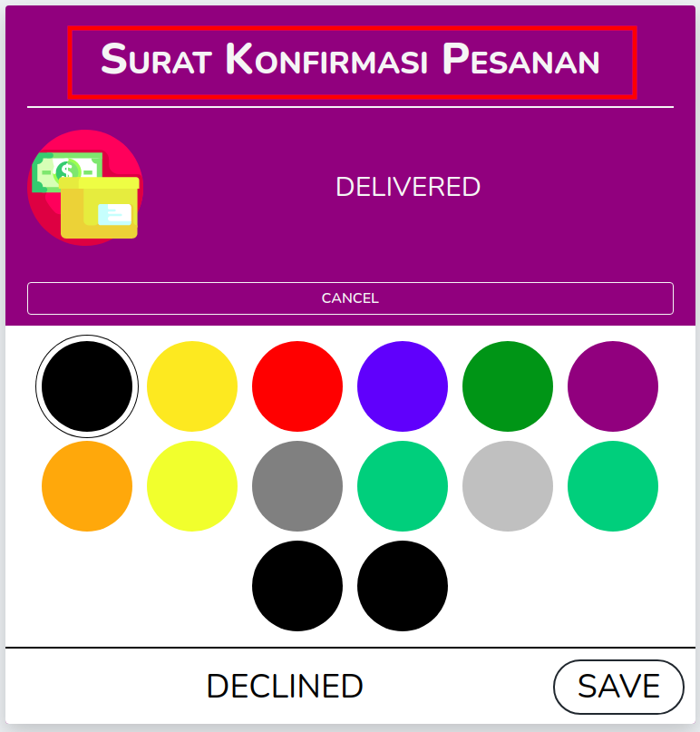
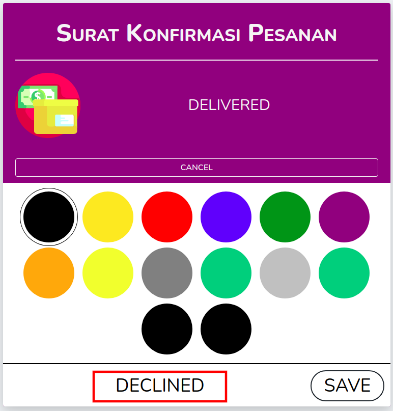
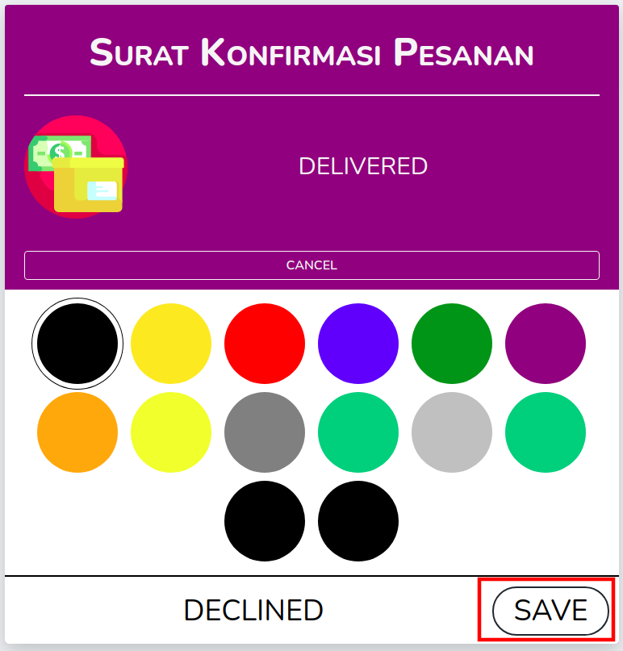
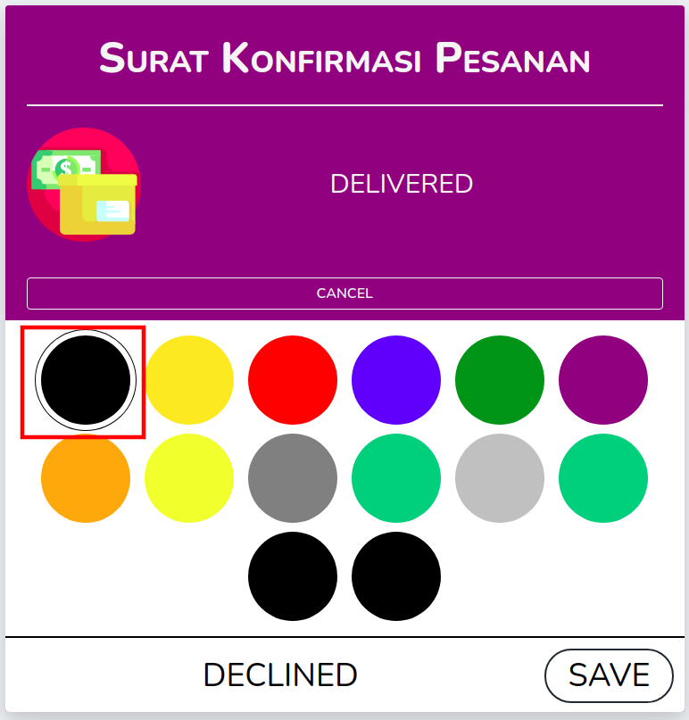

# Editable Status Card


This package lets you add a status card on your resource detail page and you can directly edit the status on the card.

## Warning

Possible **breaking changes** from v0.0.9. See [how to migrate to v1](migrating_to_v1.md) for more information.

## Installation

This package utilize [bensampo/laravel-enum](https://github.com/BenSampo/laravel-enum) package to store status data as enum class. So, make sure to check out the installation instructions there first.

After that, you can install this package via composer:

```shell
composer require joshua060198/nova-editable-status-card
```

## Usage (Example)

```php
// app/Nova/Order.php

use Joshua060198\EditableStatusCard\EditableStatusCard;

class Order extends Resource {

    ...

    public function fields(Request $request) {

        return [
            EditableStatusCard::make(
                MyEnumClass::class,
                $this->order_status_column
                'Order Status',
                'order_status_column',
            ),

            // with extra customization
            EditableStatusCard::make(
                MyEnumClass::class,
                $this->getStatusValue()
                'Other Status',
                'my_other_status_colum',
            )
                // with icon
                ->withIcon('https://icon.com/my-icon.png')

                // with sizing utility
                ->cardSize('w-1/3')
                ->titleSize('text-2xl')
                ->statusSize('text-lg')
                ->iconSize('50px'),

            // with edit permission (e.g using spatie/laravel-permission)
            EditableStatusCard::make(
                MyEnumClass::class,
                $this->getStatusValue()
                'Other Status',
                'my_other_status_colum',
            )
                ->canEdit(function() use($request) {
                    return $request->user()->can('edit status card');
                })
        ]
    }

    ...
}
```

## Background Color and Text Color

You have to use `EditableStatus` trait in your `Enum` classes as well as override `getMappedBackgroundColor()` and 'getMappedTextColor()` method.

```php
<?php

namespace App\Enums;

use BenSampo\Enum\Enum;
use Joshua060198\EditableStatusCard\EditableStatus;

final class OrderDetailStatus extends Enum
{
    use EditableStatus;

    const Declined = 0;
    const WatitingForApproval = 1;
    const Accepted = 2;

    public static function getMappedBackgroundColor() {
        return [
            'Declined' => 'black',
            'WatitingForApproval' => '#2fbb21',
            'Accepted' => 'rgba(230,132,240,0.2)',
        ];
    }

    public static function getMappedTextColor() {
        return [
            'Declined' => 'rgb(0,0,0)',
            'WatitingForApproval' => 'whitesmoke',
            'Accepted' => '#fff',
        ];
    }
}

```

## Permission (optional)

If you want to restrict the editing capability, you can use `canEdit()` method that receive either a boolean or a function that will be evaluated later.

```php
// app/Nova/Order.php

use Joshua060198\EditableStatusCard\EditableStatusCard;

class Order extends Resource {

    ...

    public function fields(Request $request) {

        return [
            EditableStatusCard::make(
                MyEnumClass::class,
                $this->getStatusValue()
                'Other Status',
                'my_other_status_colum',
            )
                ->canEdit(function() use($request) {
                    return $request->user()->can('edit status card');
                }),

            // or to disable editing
            EditableStatusCard::make(
                MyEnumClass::class,
                $this->getStatusValue()
                'Other Status',
                'my_other_status_colum',
            )
                ->canEdit(false)
        ]
    }

    ...
}
```

## Constructor

There are 2 required parameters and 2 more additional parameter for this component.

- `$class` (required)

  Enum class that holds the status data.

- `$value` (required)

  Current value to be displayed

- `$title` (optional, default = 'Status')

  The title of the card

- `$attribute` (optional, default = null)
  The column name that will stored the edited status value.

## Methods

### `compact()`

Card content will use less spacing.

#### Example

```php
// app/Nova/Order.php

use Joshua060198\EditableStatusCard\EditableStatusCard;

class Order extends Resource {

    ...

    public function fields(Request $request) {

        return [
            EditableStatusCard::make(...)
                ->compact()
        ]
    }

    ...
}
```

### `withIcon($icon)`

Set the icon for the corresponding card.

#### Param

- \$icon = the URL or full path to the icon resource.

#### Example

```php
// app/Nova/Order.php

use Joshua060198\EditableStatusCard\EditableStatusCard;

class Order extends Resource {

    ...

    public function fields(Request $request) {

        return [
            EditableStatusCard::make(...)
                ->dataFromArray('order')
                ->withIcon('https://myicon.com/icon.png')
        ]
    }

    ...
}
```

### `canEdit($callback)`

Set the permission for the editing capability in this particular card.

#### Param

- \$callback = a boolean or a function to determine the visibility of edit button (and its functionality, of course).

#### Example

```php
// app/Nova/Order.php

use Joshua060198\EditableStatusCard\EditableStatusCard;

class Order extends Resource {

    ...

    public function fields(Request $request) {

        return [
            EditableStatusCard::make(...)
                ->canEdit(false),

            // or
            EditableStatusCard::make(...)
                ->canEdit(function () use($request) {
                    return $request->user()->id == 1;
                })
        ]
    }

    ...
}
```

### `cardSize($class)`

Set the card size (**the width** of the card).

#### Param

- \$class = the class name that will be used to determine the width. You can use tailwind.css classes or make your own class.

#### Example

```php
// app/Nova/Order.php

use Joshua060198\EditableStatusCard\EditableStatusCard;

class Order extends Resource {

    ...

    public function fields(Request $request) {

        return [
            EditableStatusCard::make(...)
                ->cardSize('w-1/3')

            // or using your own
            EditableStatusCard::make(...)
                ->cardSize('my-custom-width')
        ]
    }

    ...
}
```

### `titleSize($class)`



Set the title size (the one above horizontal line).

#### Param

- \$class = the class name that will be used to determine the size of the title. You can use tailwind.css classes or make your own class.

#### Example

```php
// app/Nova/Order.php

use Joshua060198\EditableStatusCard\EditableStatusCard;

class Order extends Resource {

    ...

    public function fields(Request $request) {

        return [
            EditableStatusCard::make(...)
                ->titleSize('text-lg')

            // or using your own
            EditableStatusCard::make(...)
                ->titleSize('my-custom-text-size')
        ]
    }

    ...
}
```

### `statusSize($class)`


Set the status size (the one below horizontal line).

#### Param

- \$class = the class name that will be used to determine the status size. You can use tailwind.css classes or make your own class.

#### Example

```php
// app/Nova/Order.php

use Joshua060198\EditableStatusCard\EditableStatusCard;

class Order extends Resource {

    ...

    public function fields(Request $request) {

        return [
            EditableStatusCard::make(...)
                ->statusSize('text-sm')

            // or using your own
            EditableStatusCard::make(...)
                ->statusSize('my-custom-status-size')
        ]
    }

    ...
}
```

### `editFieldSize($class)`



Set the edit field size.

#### Param

- \$class = the class name that will be used to determine the width. You can use tailwind.css classes or make your own class.

#### Example

```php
// app/Nova/Order.php

use Joshua060198\EditableStatusCard\EditableStatusCard;

class Order extends Resource {

    ...

    public function fields(Request $request) {

        return [
            EditableStatusCard::make(...)
                ->editFieldSize('w-1/3')

            // or using your own
            EditableStatusCard::make(...)
                ->editFieldSize('my-custom-width')
        ]
    }

    ...
}
```

### `iconSize($class)`

Set the edit icon size (width = height).

#### Param

- \$class = the class name that will be used to determine the width and height of the icon. You can use tailwind.css classes or make your own class.

#### Example

```php
// app/Nova/Order.php

use Joshua060198\EditableStatusCard\EditableStatusCard;

class Order extends Resource {

    ...

    public function fields(Request $request) {

        return [
            EditableStatusCard::make(...)
                ->iconSize('w-32')

            // or using your own
            EditableStatusCard::make(...)
                ->iconSize('my-custom-icon-size')
        ]
    }

    ...
}
```

### `saveButtonSize($class)`



Set the edit save button text size.

#### Param

- \$class = the class name that will be used to determine the save button. You can use tailwind.css classes or make your own class.

#### Example

```php
// app/Nova/Order.php

use Joshua060198\EditableStatusCard\EditableStatusCard;

class Order extends Resource {

    ...

    public function fields(Request $request) {

        return [
            EditableStatusCard::make(...)
                ->saveButtonSize('text-lg')

            // or using your own
            EditableStatusCard::make(...)
                ->saveButtonSize('my-custom-save-button')
        ]
    }

    ...
}
```

### `choicesSize($class)`



Set the choices button size.

#### Param

- \$class = the class name that will be used to determine the choices button size. **Caution: do not use class name.**

#### Example

```php
// app/Nova/Order.php

use Joshua060198\EditableStatusCard\EditableStatusCard;

class Order extends Resource {

    ...

    public function fields(Request $request) {

        return [
            EditableStatusCard::make(...)
                ->choicesSize('200px')

            // or
            EditableStatusCard::make(...)
                ->choicesSize('2.5rem')
        ]
    }

    ...
}
```

## Special Thanks

Thanks to [@BenSampo](https://github.com/BenSampo) for creating such a powerful enumeration implementation on laravel :)

## License

The [MIT](LICENSE) license.
